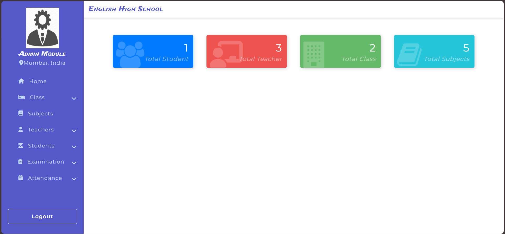
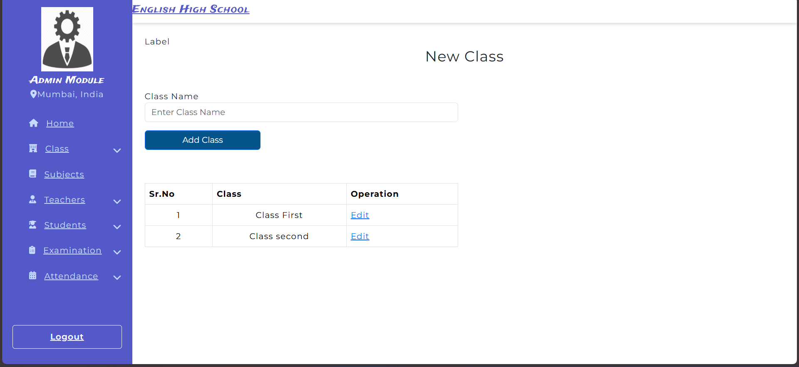
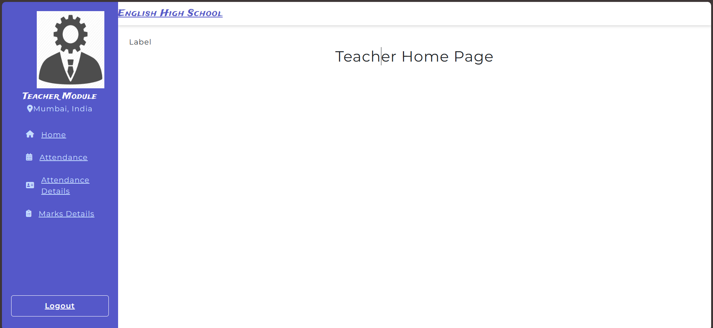

# 🏫 School Management System

A responsive ASP.NET Web Forms application to manage school operations efficiently. Modules include administration, teacher management, student registration, class and subject setup, attendance, and examination tracking.

---

## 🌐 Features

- **Authentication**
  - Secure login for different roles: Admin & Teacher.

- **Admin Dashboard**
  - Overview stats: total students, teachers, classes, subjects.
  - Manage modules:
    - **Class**: Create, view, and update class entries.
    - **Subjects**: CRUD operations for subjects.
    - **Teachers**: Register teachers, update profiles.
    - **Students**: Enroll students, update records.
    - **Examinations**: Schedule exams, record results.
    - **Attendance**: Track and report student attendance.

- **Teacher Dashboard**
  - Mark student attendance.
  - View and manage attendance details.
  - Input and review student marks.

---

## 📸 Screenshots

1. **Login Page (Admin/Teacher access)**  
   

2. **Admin Dashboard**  
   Displays key counts: Students, Teachers, Classes, Subjects.  
   

3. **Class Management**  
   Create new class and edit existing entries.  
   

4. **Teacher Dashboard**  
   Manage attendance and marks.  
   

---

## 🛠️ Technologies Used

- **Backend:** ASP.NET Web Forms (C#)
- **Database:** SQL Server (or your choice of relational DB)
- **Frontend:** Bootstrap or custom CSS for responsive layouts
- **Architecture:** Multi-tier: Presentation → Business Logic → Data Access

---

## 🚀 Getting Started

### Prerequisites

- Visual Studio 2019 or later
- .NET Framework 4.x
- SQL Server (Express/Developer/Production)

### Installation Steps

1. **Clone the repository**  
   ```bash
   git clone https://github.com/your-username/school-management-system.git
   cd school-management-system
